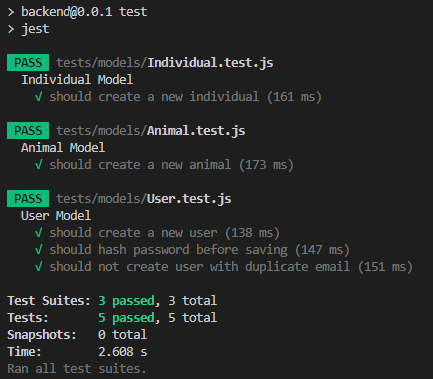

# Test Runs

## Specifications
- Framework: Jest
- Local mongoDB instance through docker container.
- OS: Windows 11

## Method
Used docker desktop to start mongoDB in a container for model testing.
```bash
$ docker run --name mongo-test -p 27017:27017 -d mongo
```
Create a .env.test-file in the root of the project with the following contents:
```
MONGODB_URI=mongodb://localhost:27017/farmtrack
JWT_SECRET=test-secret-key
PORT=3001
```

## Result (May 29th 2025)
### Terminal Output
